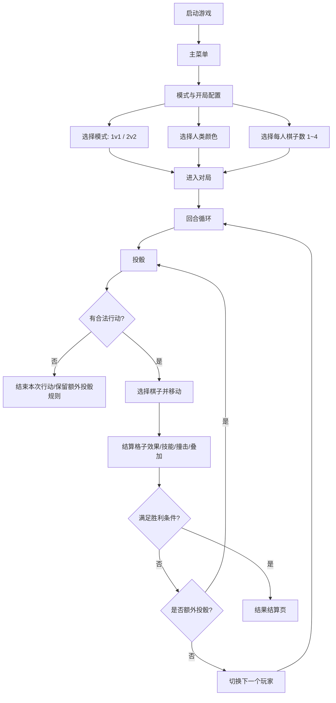
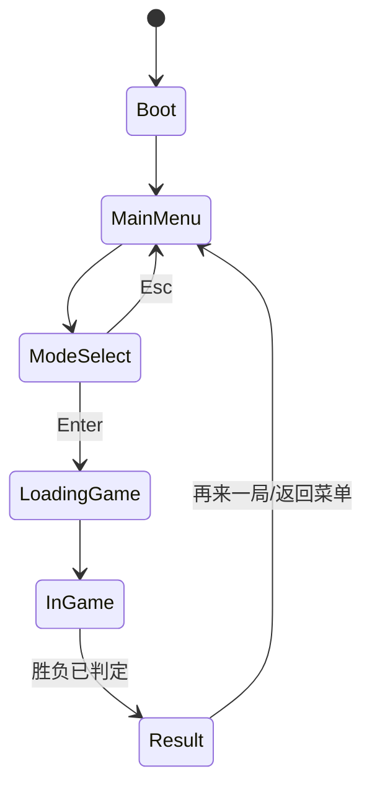
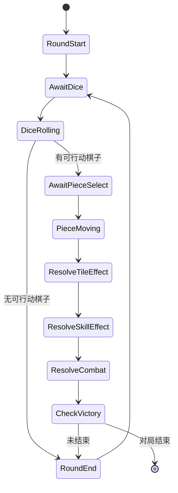
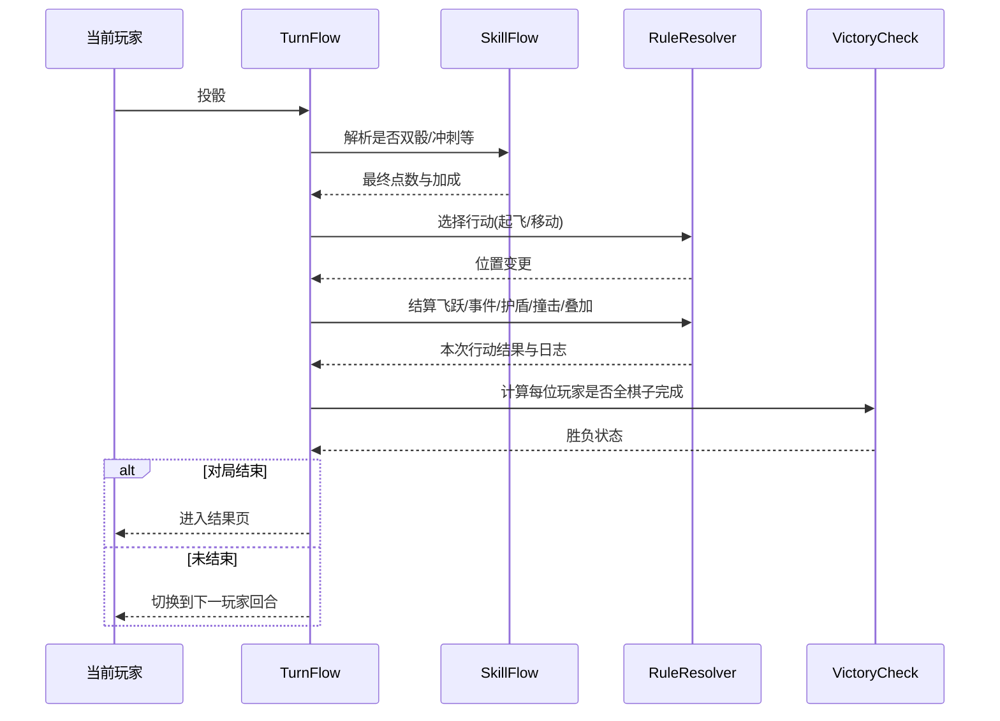
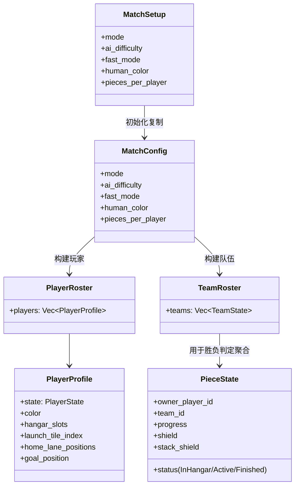
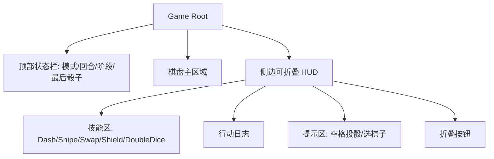

# 飞行棋游戏设计图（按需求与规则）

本文档基于以下两份文档生成：

- [requirement.md](/Users/zhaodaojun/Documents/studio/404man/code/aeroplane-chess/requirement.md)
- [rules-spec.md](/Users/zhaodaojun/Documents/studio/404man/code/aeroplane-chess/docs/rules-spec.md)

## 1. 整体玩法流程图



## 2. AppState 状态机图



## 3. 对局内 GamePhase 状态机图



## 4. 开局配置交互图（新增规则）

```mermaid
flowchart LR
    A[ModeSelect 页面] --> B[按 1/2 切换模式]
    A --> C[按 C 切换人类颜色]
    A --> D[按 [ 或 - 减少棋子数]
    A --> E[按 ] 或 = 增加棋子数]
    D --> F[棋子数限制到 1..4]
    E --> F
    B --> G[实时刷新 HUD 文本]
    C --> G
    F --> G
    G --> H[按 Enter 开始]
    H --> I[生成 MatchConfig + 玩家队伍与棋子]
```

## 5. 回合结算时序图（规则执行）



## 6. 核心数据关系图



## 7. HUD 布局线框图（避免遮挡版）



---

以上设计图覆盖了当前 MVP 已实现与近期规则改造（开局颜色、棋子数量 1~4）对应的核心交互与数据流，可直接用于后续 UI 重构、功能补完与测试用例映射。
