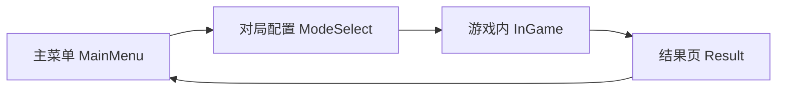
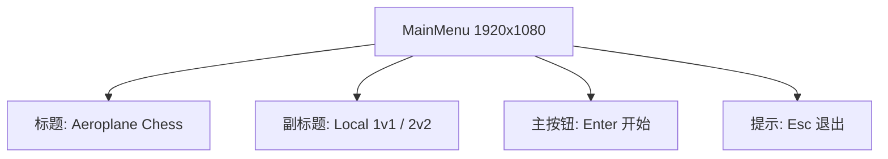
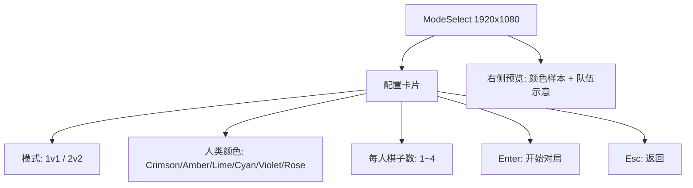
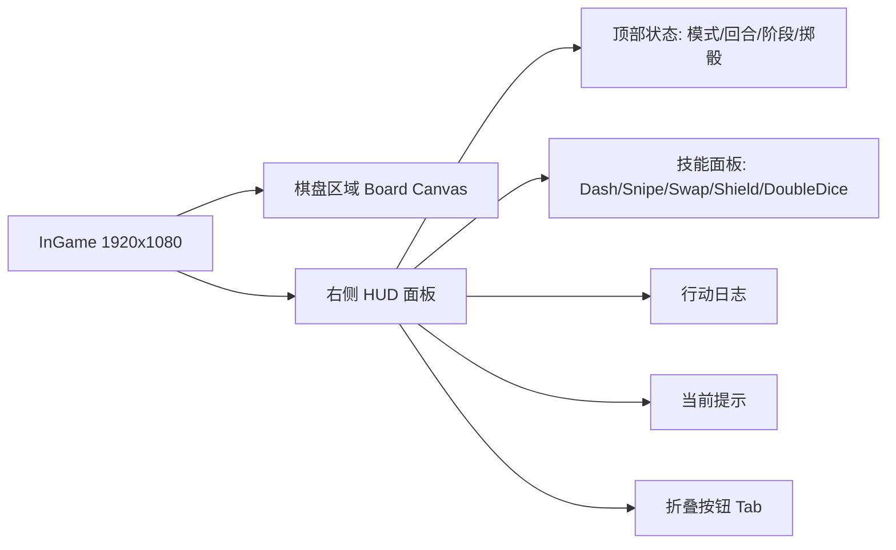
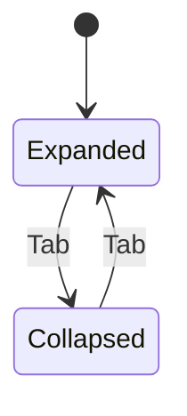
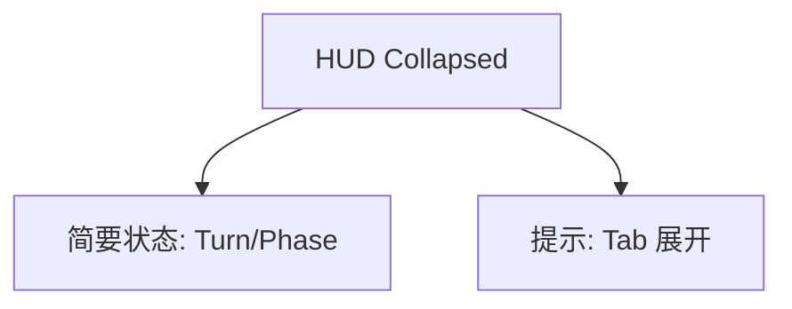
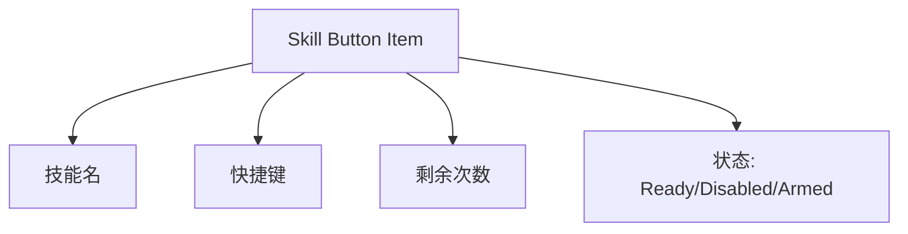
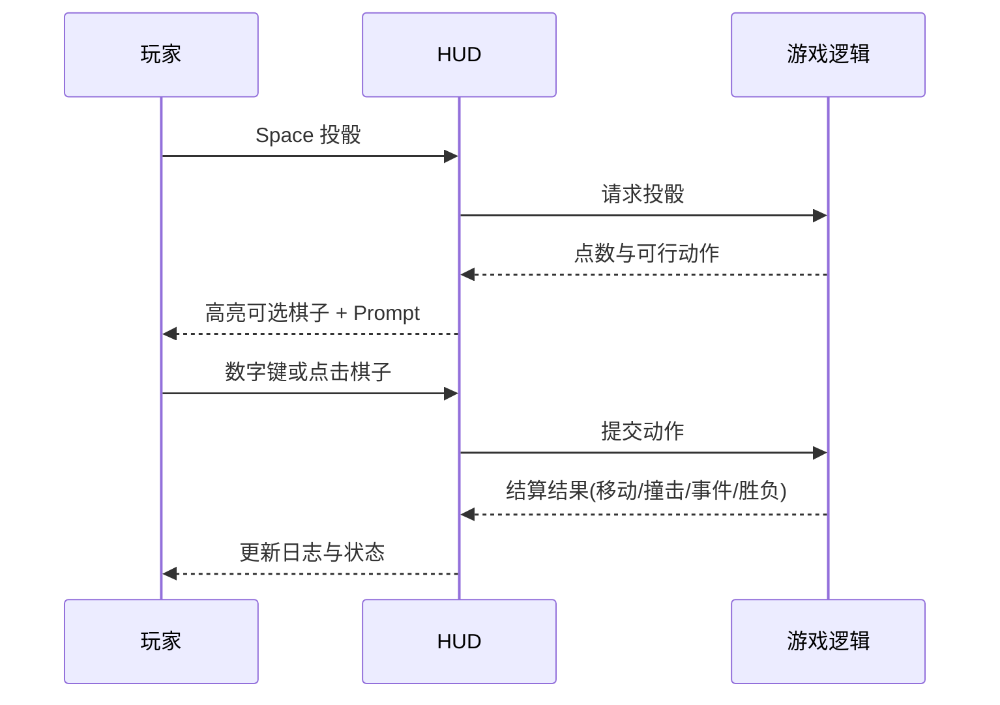
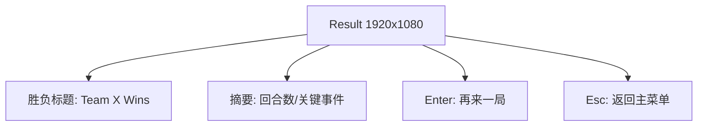

# 飞行棋 UI 设计图（实现参考）

本文档用于后续 UI 实现，提供页面结构图、HUD 线框图、组件状态图和响应式布局规则。  
对齐文档：

- [requirement.md](/Users/zhaodaojun/Documents/studio/404man/code/aeroplane-chess/requirement.md)
- [rules-spec.md](/Users/zhaodaojun/Documents/studio/404man/code/aeroplane-chess/docs/rules-spec.md)

## 1. 页面信息架构图



## 2. 主菜单 UI 线框图



实现约束：

- 标题区垂直居中偏上（约 35% 高度）
- 主按钮视觉权重大于其它文本
- 输入提示固定在底部安全区

## 3. 对局配置页 UI 线框图（重点）



交互键位：

- `1/2`：切换模式
- `C`：循环颜色
- `[` 或 `-`：棋子数减 1（最小 1）
- `]` 或 `=`：棋子数加 1（最大 4）
- `Enter`：进入对局

## 4. 游戏内界面总体布局图（无遮挡版本）



布局约束（桌面）：

- 棋盘区域占宽度约 `70%~75%`
- HUD 面板固定右侧，占宽度约 `25%~30%`
- HUD 折叠后仅保留顶部状态条和折叠提示，不遮挡棋盘交互区域

## 5. HUD 展开/折叠状态图



### 5.1 展开态线框

```mermaid
flowchart TB
    HUD[HUD Expanded]
    HUD --> H1[Mode | AI | Turn | Round]
    HUD --> H2[Phase | Last Roll | Last Action]
    HUD --> H3[技能列表 + 可用次数 + 可用状态]
    HUD --> H4[Prompt: 空格投骰 / 数字选棋子 / 点击选棋子]
```

### 5.2 折叠态线框



## 6. 技能面板组件图



按钮状态规范：

- `Ready`：可点击，强调色背景
- `Disabled`：灰态，不可点击
- `Armed`：高亮描边，表示已预备（如 Dash/DoubleDice）

## 7. 回合交互 UI 时序图



## 8. 结果页 UI 线框图



## 9. 响应式与安全区规则

断点建议：

- Desktop：`>= 1280`
- Tablet：`768 ~ 1279`
- Mobile/Web 小窗：`< 768`

规则：

- 小屏优先保留棋盘可见区域，HUD 默认折叠
- 状态信息由多行压缩为两行（Mode/Turn 一行，Phase/Prompt 一行）
- 技能按钮改为 2 列网格，避免超出底部

## 10. UI 视觉 Token（实现基线）

```text
Font Size:
- Title: 42
- Section: 28
- Body: 16
- Hint: 14

Radius:
- Card: 12
- Button: 8

Spacing:
- Section Gap: 16
- Item Gap: 8
- Safe Margin: 16
```

颜色分层建议：

- 背景层：低饱和浅色，保证棋盘对比
- 信息层：深色文本（可读性优先）
- 强调层：按玩家颜色与技能状态使用高亮色

---

该文档作为 UI 实现参考基线。后续如果你要，我可以继续产出下一层：  
1) 每个页面的像素级标注图  
2) 直接映射 Bevy UI `Node` 树的组件清单（可按文件拆分）
